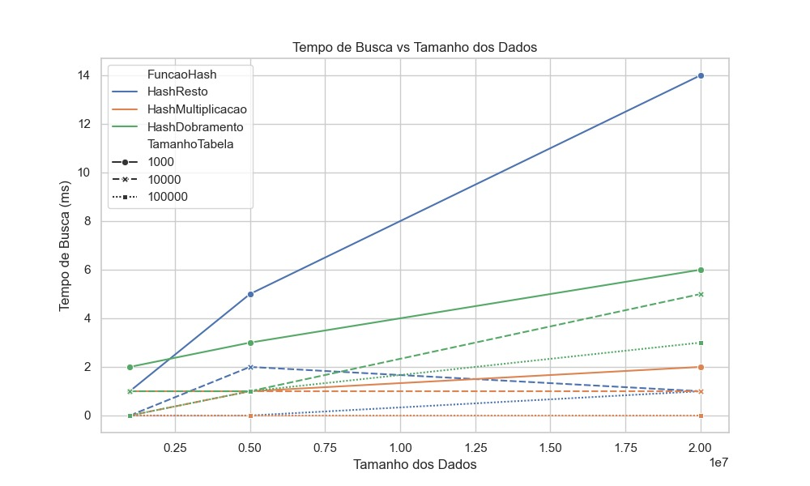
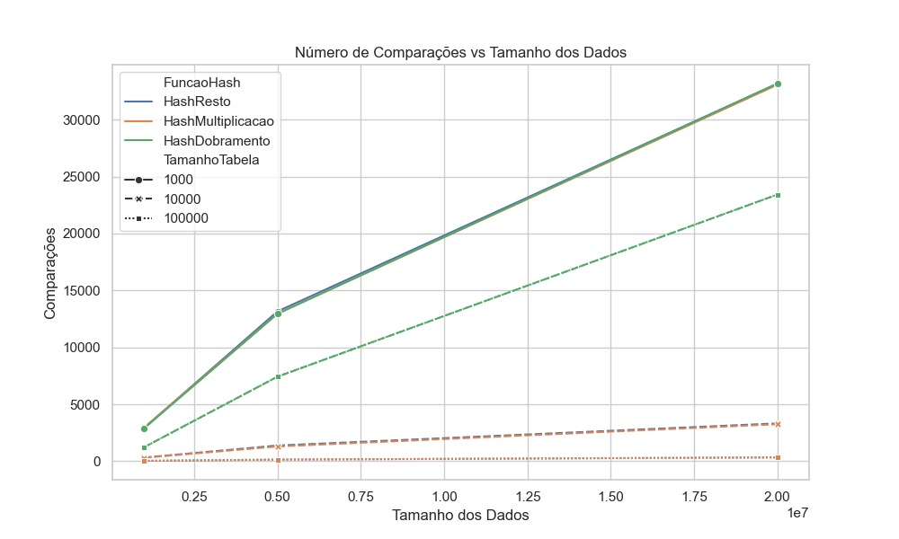
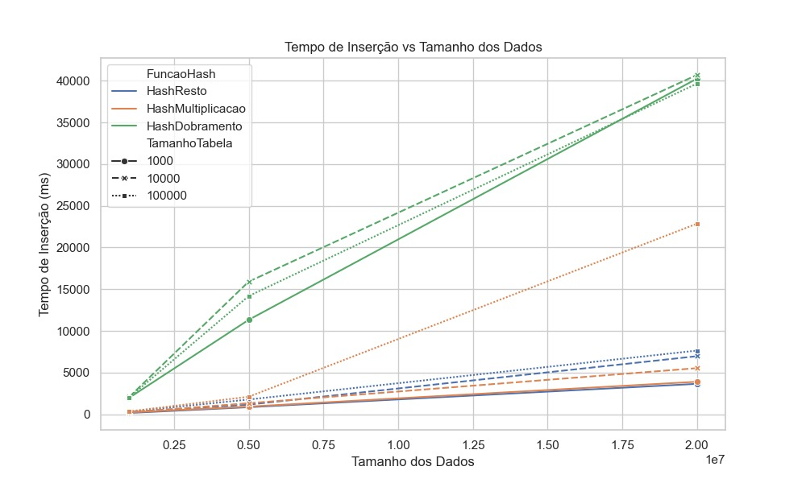

# Análise de Desempenho de Tabelas Hash em Java

Este projeto tem como objetivo implementar e analisar o desempenho de diferentes estratégias de tabelas hash em Java, conforme os requisitos do trabalho prático de Estrutura de Dados.

---

## 📌 Objetivos

- Implementar diferentes funções hash (resto da divisão, multiplicação e dobramento).
- Testar com três tamanhos diferentes de vetor (10.000, 100.000 e 1.000.000).
- Avaliar desempenho com conjuntos de 1M, 5M e 20M registros.
- Medir tempo de inserção, número de colisões, tempo de busca e comparações.
- Exibir resultados em tabelas e gráficos.

---

## 🔧 Estrutura do Projeto

| Arquivo                | Descrição                                                                 |
|------------------------|--------------------------------------------------------------------------|
| Main.java              | Classe principal: executa os testes e mede desempenho.                  |
| Registro.java          | Representa os registros (com código de 9 dígitos).                      |
| TabelaHash.java        | Implementa a estrutura de tabela hash com tratamento de colisões.       |
| FuncaoHash.java        | Interface comum para as funções hash.                                   |
| HashResto.java         | Função hash usando o método do resto.                                   |
| HashMultiplicacao.java | Função hash usando multiplicação.                                       |
| HashDobramento.java    | Função hash usando dobramento.                                          |
| GeradorDados.java      | Gera os dados aleatórios com seed fixa.                                 |

---

## ⚙️ Parâmetros Utilizados

- Tamanhos do vetor:
  - 10.000
  - 100.000
  - 1.000.000

- Tamanhos dos conjuntos de dados:
  - 1.000.000 registros
  - 5.000.000 registros
  - 20.000.000 registros

- Funções hash:
  - Resto da divisão (chave % tamanho)
  - Multiplicação (Knuth)
  - Dobramento (soma de blocos de dígitos)

- Colisão:
  - Encadeamento com listas encadeadas
  - Sem rehashing (conforme especificado nos requisitos)

---

## 📊 Resultados

Foram realizadas 27 rodadas (3 tamanhos de vetor × 3 tamanhos de conjunto × 3 funções hash). Para cada combinação, foram medidos:

- Tempo de inserção
- Número de colisões
- Tempo de busca (média de 5 buscas por rodada)
- Número de comparações nas buscas

### 🔍 Tempo de Busca vs. Tamanho da Tabela

---

### 📌 Comparações vs. Tamanho da Tabela

---

### ⏱️ Tempo de Inserção vs. Tamanho da Tabela

---

## 💡 Justificativas

- Utilizamos seed fixa para garantir reprodutibilidade.
- Tamanhos de vetor crescentes em x10 foram usados para testar escalabilidade.
- As funções escolhidas representam abordagens distintas e clássicas.
- O tratamento de colisões foi feito exclusivamente por encadeamento, conforme permitido.
- O trabalho não utiliza rehashing, respeitando a diretriz de realizar, no máximo, um rehash simples se desejado (mas aqui não foi utilizado).
